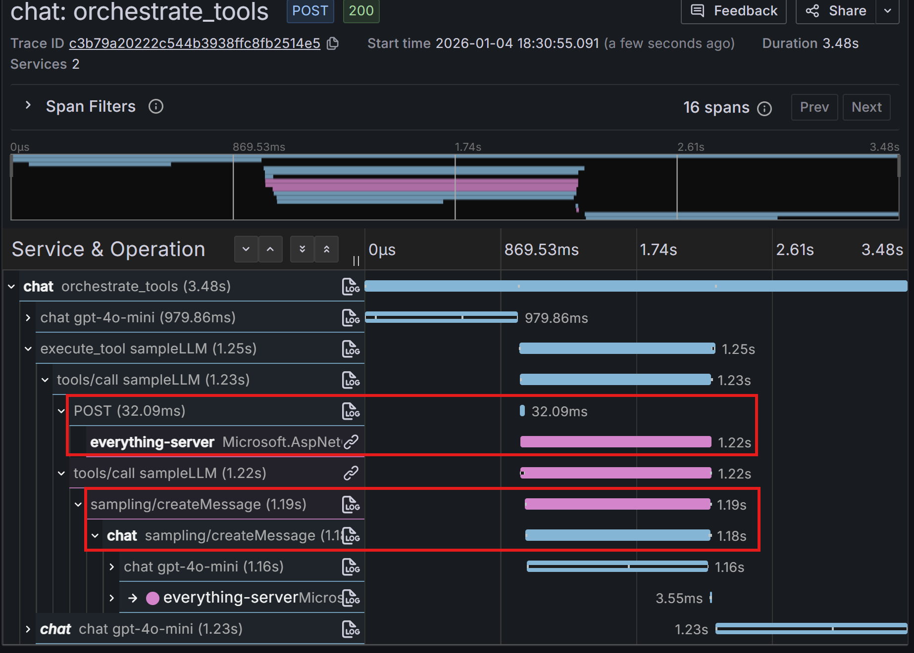

Generative AI applications are fun to work with - their outputs are non-deterministic and creative.

[Model Context Protocol](https://modelcontextprotocol.io/) (MCP) makes them super-powerful by enabling AI applications to connect to tools and data sources—like accessing files, querying databases, or calling APIs—giving models the ability to take actions beyond just generating text.

We're excited to announce new semantic conventions for MCP.

When generating a response, the model decides which tools to call, how to provide arguments, and how to interpret responses.
Tools themselves can be complicated - from listing source code files in your project or querying databases to executing independent workflows
with real-world consequences. MCP semantic conventions and instrumentations allow us to capture details related to tool execution,
understand which tools were called and with which outcomes, and even more importantly see things that happened within the scope of tool
execution such as DB, messaging or other operations.

Along with Generative AI semantic conventions and instrumentations, the MCP layer helps us understand how our application works
and whether it serves our users effectively.

The new semantic conventions define spans and metrics for observing MCP client-server interactions, including:

- **Tool execution visibility** - Track which tools were called, with what arguments, and what results they produced
- **Resource and prompt operations** - Monitor how your MCP server accesses resources (files, databases) and retrieves prompts
- **Session lifecycle** - Understand client behavior by looking at session duration and operations within one session
- **Multi-transport support** - Works across different transports (stdio, HTTP/2)

TODO link to conventions!

Let's see why this matters:

## Observability in Action: Tracing Tool Failures

Models can explore and modify files on your computer or write and execute database queries via MCP tools.
These powerful capabilities mean a lot can happen when models pick tools and run them in a loop.

Imagine this:

I have an MCP weather service and the service is not available (or misconfigured). What would the model do?
Well, it'd probably tell you, right? Yes, if your tool told the model about failure, and also after a possibly long wait.

```text
Q: weather in Seattle today
A: I'm currently experiencing issues retrieving weather information for Seattle.
You might want to check a reliable weather website or app for the latest update
```


Here we see that the first call to `get_forecast` tool failed with `connection_error`. It was retried and then the model
decided to call `get_alerts` tool which also failed with the same error. Why model decided to call it? Who knows, but it probably was not needed.
Finally the model gave up and returned the response above.

This interaction consumed 780 input and 188 output tokens, which we can see on the GenAI `chat` span attributes. While not excessive,
this was enough for my model provider to start throttling requests, resulting in the long response time on the last `chat` call.

**Consider a second scenario:** What if we had another tool that returns typical weather in this location in this season? The model would probably call it:


In this case we see that `get_forecast` tool was called once, it failed, the model didn't retry and instead called `get_typical_weather` tool,
which returned successfully! Here's what I've got:

```text
Q: weather in San Jose, Costa Rica today
A: {"temperature":"10°C to 25°C","condition":"generally warm with a chance of afternoon rain."}
```

> [!NOTE]
>
> I'm cheating there and asking the model to return a JSON response and it has nowhere to put information about errors. Don't repeat my mistakes!
> But guess what, in this case the model did not use tool responses at all because my `get_typical_weather` tool returned something implausible for San Jose,
> like heavy snow, dark days, and freezing. When I asked it about the weather in the Land of Oz, it happily returned that freezing snowy forecast!

To summarize: **the quality of model output and its performance was heavily affected by the choice of tools, performance of tool execution, and quality of tool results.**

To understand what exactly went wrong, where and why, we use distributed tracing - the
screenshots above show detailed visibility into the sequence of events, tool invocations, and failure points.

MCP conventions and instrumentation plays important role, capturing important MCP properties and enabling
distributed tracing with context propagation and allowing to see what happens under the hood of the MCP server.

> [!NOTE]
>
> The screenshots used here are based on a draft version of MCP conventions and don't reflect the latest version.

## FAQ

### How does context propagation work with MCP?

The conventions cover context propagation within MCP requests and notifications, leveraging
MCP's [`params._meta`](TODO link) property bag using W3C Trace Context or any other propagation format,
allowing you to trace requests end-to-end: from the end user to the AI application, through the MCP protocol layer,
and into the actual tool execution—however deep it is. Check out how it [works along with HTTP context propagation](#how-does-mcp-instrumentation-interact-with-http-instrumentation).

### How does MCP instrumentation interact with HTTP instrumentation?

When using MCP over HTTP, would we even need MCP instrumentation? Do we need a
separate context?

When using MCP over streamable HTTP, one MCP request (or notification)
can involve more than one HTTP request. For example, if HTTP request fails
and is retried.

MCP requests (or notifications) don't necessarily need a new HTTP request to be issued.
For example, when using sampling TODO link, the client initiates the original MCP request
and the server, while serving this request, would start an MCP call requesting
the LLM on the client to generate something.



In terms of HTTP, what happens here is:

- the MCP client starts an HTTP request and waits for MCP response to come over HTTP stream. HTTP client span actually
  ends right away, when response status headers and response are received. It does not include streaming.
- the server uses the same HTTP stream to send MCP request back to client - on the screenshot we see that server initiates operation back to client.
- the client replies over the same HTTP stream
- the server completes the response to the original request
- the client receives it

So in this case, the HTTP stream was used as a transport for two different MCP requests.
A similar situation happens with resource or prompt notifications: the client, when session starts,
issues an HTTP request and keeps the corresponding stream open to receive notifications
from the MCP server.

So, when writing these conventions, we completely decouple MCP context from the
corresponding transport context. This provides consistency in tracing between MCP transports used,
allows MCP instrumentation to stay useful when HTTP is not instrumented.

We recommend to use trace context from MCP request or notification as a parent on
the MCP server and, if HTTP server instrumentation also created a span, link
that span to MCP server one.

### How does MCP instrumentation interact with RPC instrumentations?

RPC semantic conventions are intended for general-purpose RPC frameworks, such as gRPC or JSON-RPC.
MCP is a layer on top of this: it provides specific models and flows that leverage JSON-RPC.
It's not a protocol for general-purpose remote procedure calling.

It's also common that MCP implementations don't take dependency on JSON-RPC libraries but rather
follow JSON-RPC semantics, so we don't expect to see MCP and JSON-RPC spans and metrics
coexisting (and being somewhat duplicative) in the same application.

### How does MCP work along with GenAI instrumentations?

MCP spans and metrics complement Generative AI spans. When a GenAI agent is invoked,
it has child spans capturing individual model calls, interleaved with tool executions
recorded by MCP instrumentations.
It may, however, result in duplication when both the agent and MCP instrument the client-side
of the tool calling as you can see in this screenshot:


We recommend using one of the following mitigations:

- If GenAI instrumentation can reliably determine that the tool being executed is an MCP tool, it may skip creating tool calling spans,
  delegating it to MCP instrumentation (which the user may or may not enable independently).
- GenAI instrumentation, when instrumenting a tool call, should record that span in the OpenTelemetry Context under a key indicating
  it's a tool call.
  MCP instrumentations, before starting their own span, should check if that context key is present and points to a valid span.
  In that case, they should not start a new span but add MCP-specific details to that span.

This behavior, regardless of the approach, can be made configurable by instrumentation authors.
The goal is to create just one client span for the tool call. MCP tool execution and GenAI tool execution spans are compatible with each other.

### Who owns MCP server telemetry? Who should receive it?

The telemetry described by OpenTelemetry conventions is intended for organizations and teams that run the server.
For example, if a database provider ships an MCP server binary for their database but it's hosted by the user, the user should be able
to configure OpenTelemetry SDK, applicable instrumentations, and the OTel endpoint to send telemetry to. We don't
recommend enabling telemetry on MCP servers by default or sending it to the MCP server publisher, as doing so would create privacy concerns.

When the MCP server is operated by the database provider, for example, as an interface for their cloud database offering, they host the MCP server and
ultimately own the telemetry pipeline and data.

We encourage MCP servers that are intended to be self-hosted to allow end users to enable and configure OpenTelemetry.
While we recognize that tracking usage and sending some telemetry back to the publisher is important, such telemetry should be tracked separately.
OpenTelemetry MCP semantic conventions cover the operational and performance aspects.

## Share your feedback

We'd love to hear your thoughts! Come share feedback by creating an issue in the semantic conventions repo (todo link) or posting in
the otel-genai slack channel (todo link).

